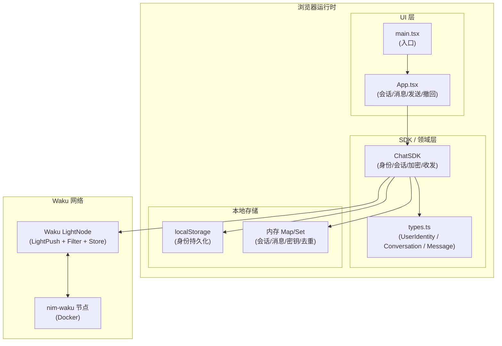
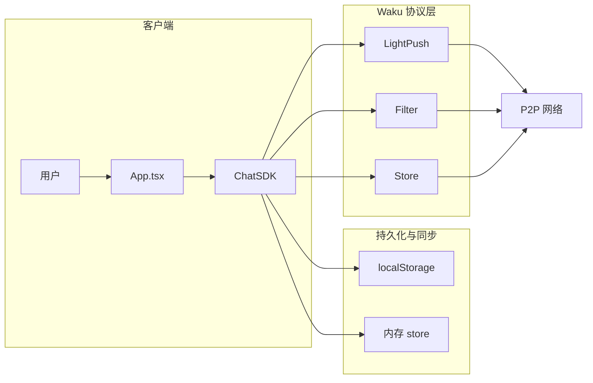
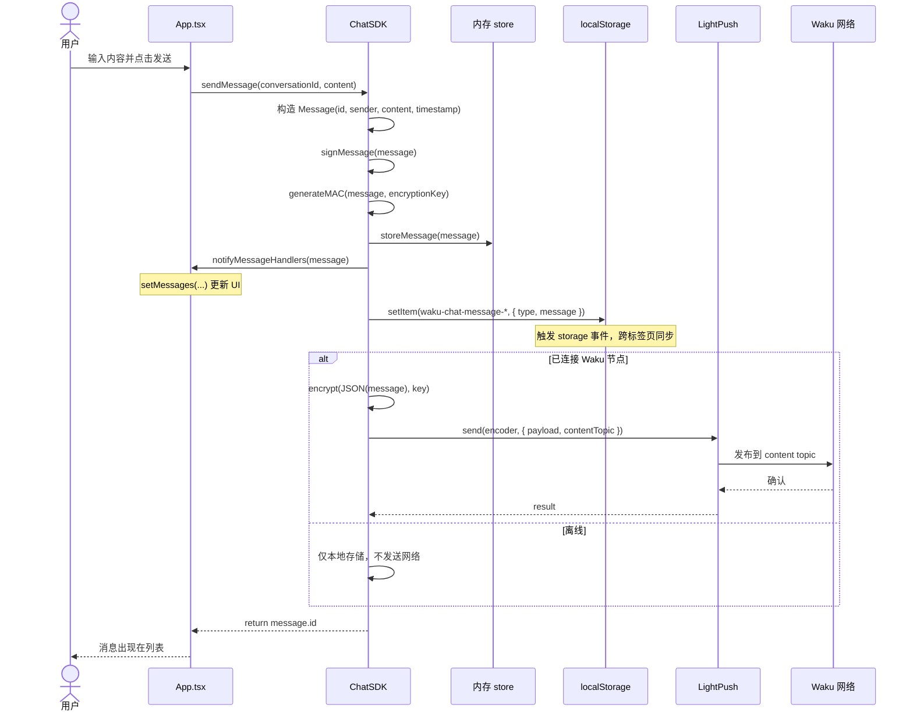
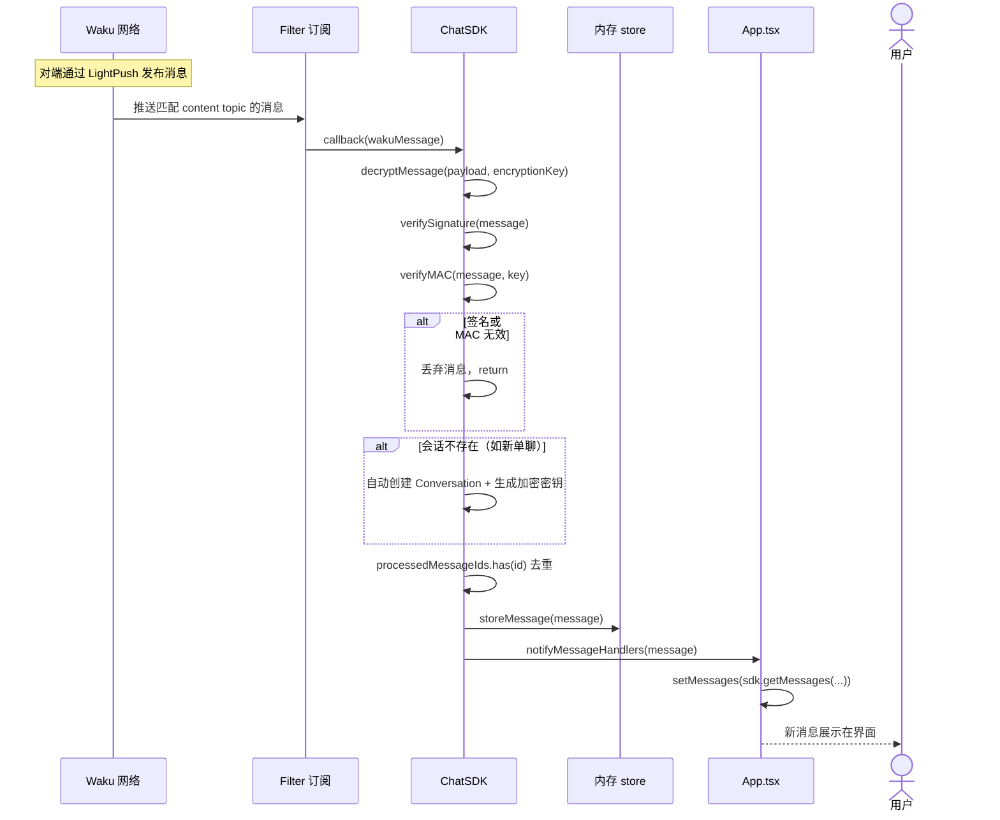
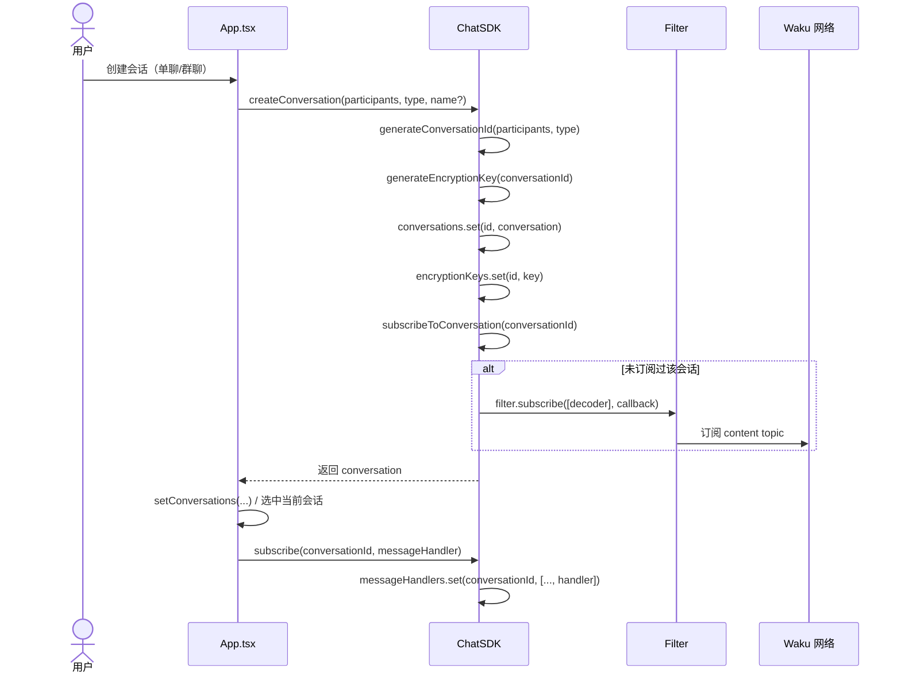
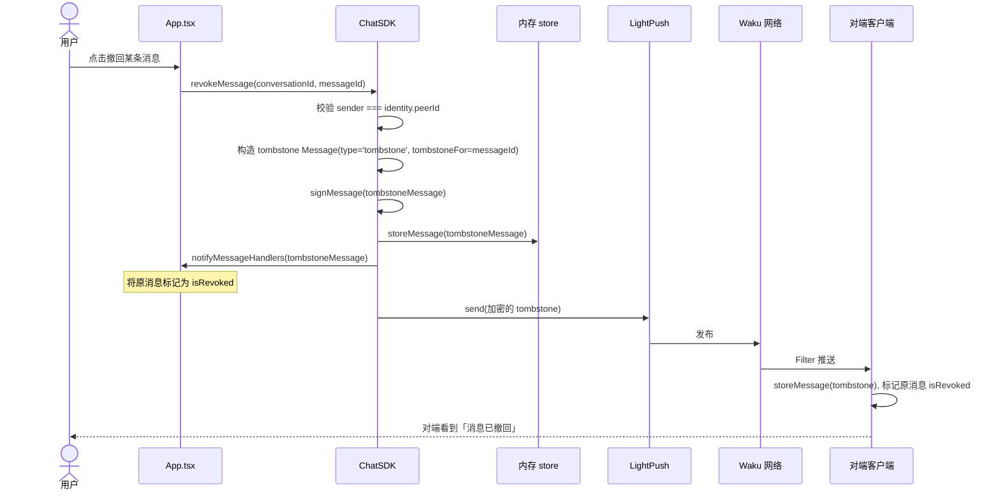
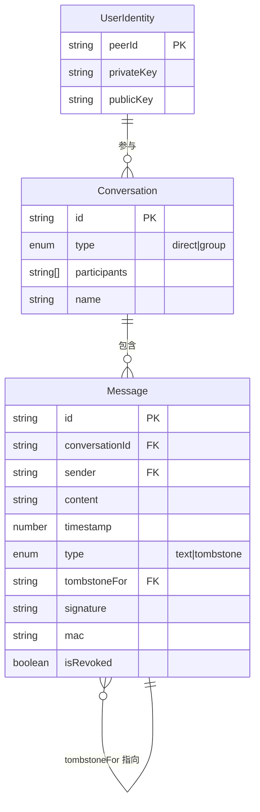
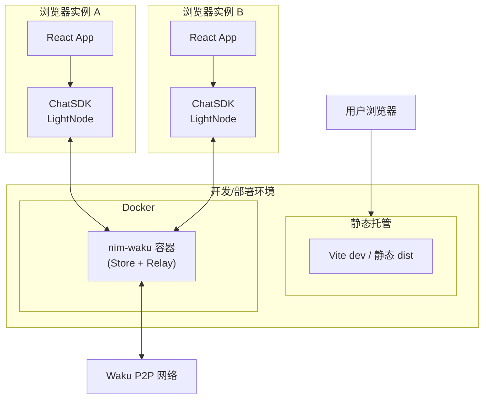

# waku-demo 架构与时序图

本文档使用 Mermaid 描述项目整体架构及核心流程时序。

---

## 一、系统架构图（分层）

---

## 二、组件与数据流

---

## 三、发送消息时序图

---

## 四、接收消息时序图

---

## 五、会话创建与订阅流程

---

## 六、消息撤回（Tombstone）时序

---

## 七、数据模型关系（概念）

---

## 八、部署与运行时拓扑

---

以上图表可在支持 Mermaid 的 Markdown 预览（如 VS Code、GitHub、GitLab）中直接渲染。若需导出为 PNG/SVG，可使用 [Mermaid Live Editor](https://mermaid.live) 或 `@mermaid-js/mermaid-cli`。
